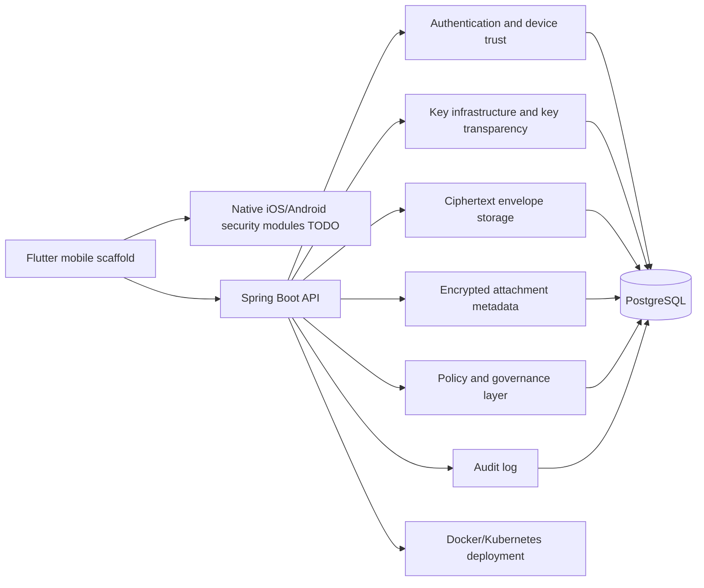
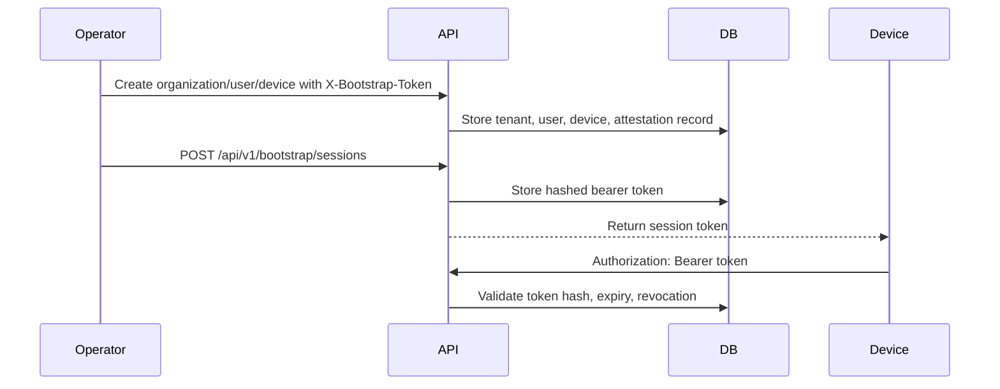
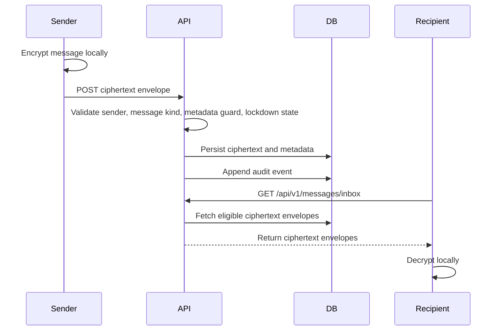

# Architecture

Crypta is an alpha-stage, security-focused scaffold for zero-trust, end-to-end encrypted communication. The backend is intended to store and route ciphertext envelopes, public key material, policy records, and audit metadata while clients remain responsible for encryption, decryption, private keys, and message plaintext.

Some code and package names still use `Sovereign Comm`; this documentation uses the repository name Crypta.

## High-Level Architecture Overview

## Backend Modules

- `api`: REST controllers for organizations, users, devices, WebAuthn, bootstrap sessions, keys, messages, attachments, rooms, admin actions, and governance.
- `service`: Service interfaces and JDBC-backed implementation for core behavior.
- `security`: Bearer-token authentication, bootstrap-token authentication, token hashing, and plaintext metadata guard.
- `crypta-security-verifier`: Go sidecar for security verification jobs such as device attestation shape checks, key-transparency checkpoints, audit-chain checkpoint validation, and signed admin action envelope checks.
- `config`: Spring Security, request ID handling, and authenticated actor model.
- `crypto`: Provider contracts for direct crypto, group crypto, key transparency verification, device attestation, and secure storage.
- `cql`: ANTLR-based compliance query parsing and execution.
- `smalltalk`: Lightweight policy/rule evaluation prototype.
- `resources/db/migration`: Flyway-managed PostgreSQL schema.

## Mobile Client Structure

The `mobile` directory is a contract-first Flutter scaffold, not a complete secure mobile client. It contains UI structure and provider boundaries for:

- Direct-message crypto provider.
- Group-message crypto provider.
- Key transparency verifier.
- Secure storage provider.
- Native security module integration.

Native iOS and Android secure-key storage, biometric-gated unwrap, device attestation, and local encrypted database behavior remain TODO items.

## Authentication Flow

Bootstrap authentication is an onboarding-only path for initial tenant, user, device, and bootstrap session creation. Admin, governance, key, room, message, attachment, and device-revocation flows require bearer sessions. WebAuthn/passkey registration and login use persisted Yubico ceremony options and store only verified credentials for login; legacy demo credentials are excluded.

## Message Envelope Flow

The backend should never receive message plaintext, attachment plaintext, private keys, or group secrets.

## Key Infrastructure

The backend stores public identity keys and prekey records:

- Identity public keys.
- Signed prekeys.
- One-time prekeys.
- PQ prekeys.
- Key bundles by user.

These records are architectural support for Signal-style and PQXDH-style flows. They are not a complete audited protocol implementation.

## Key Transparency

Identity key uploads append key transparency entries with canonical entry hashes, Merkle-leaf-style hashes, log indexes, signed tree heads, inclusion proof metadata, consistency proof metadata, checkpoint IDs, and proof versions. In production this path is intended to call the Go verifier service; local development can use a deterministic fallback so the backend remains runnable.

## Audit Logging

Security-relevant events are appended to `audit_events` with hash-chain style integrity fields. Events include organization creation, user registration, device changes, key uploads, ciphertext acceptance, attachment creation, room changes, admin actions, audit exports, and lockdown actions.

Audit logs may still contain metadata and must be handled as sensitive operational data.

## Attachment Flow

Clients are expected to encrypt attachments locally. The backend records encrypted attachment metadata:

- Room identifier.
- Object key.
- Ciphertext SHA-256.
- Ciphertext byte length.
- Crypto metadata.

Download responses return metadata-only signed grants with object key, ciphertext hash, ciphertext size, grant token, grant signature, and expiry. A real cloud object-store adapter still needs to replace the placeholder URL with provider-specific pre-signed URLs.

## Policy/Governance Layer

The governance layer includes:

- CQL parsing and organization-scoped execution against approved governance data with table/column allowlists and result caps.
- Smalltalk-style rule evaluation for policy experiments, disabled by default unless explicitly enabled for a runtime profile, with recursive plaintext-shaped input/output checks.
- Room policy versioning.
- Admin action recording.
- Emergency lockdown records.

This layer is experimental and needs strict sandboxing, authorization review, audit review, and threat model validation before production use.

## Deployment Structure

- `docker-compose.yml`: local PostgreSQL and backend development.
- `Dockerfile`: Maven build stage and Java 21 runtime image.
- `k8s/base`: Kubernetes base resources for namespace, config, secret example, deployment, service, ingress, HPA, and network policy.
- `.github/workflows/ci.yml`: Maven tests, container build, SBOM attempt, and kustomize rendering.

The Kubernetes files are a starting point and require environment-specific hardening before real deployment.
