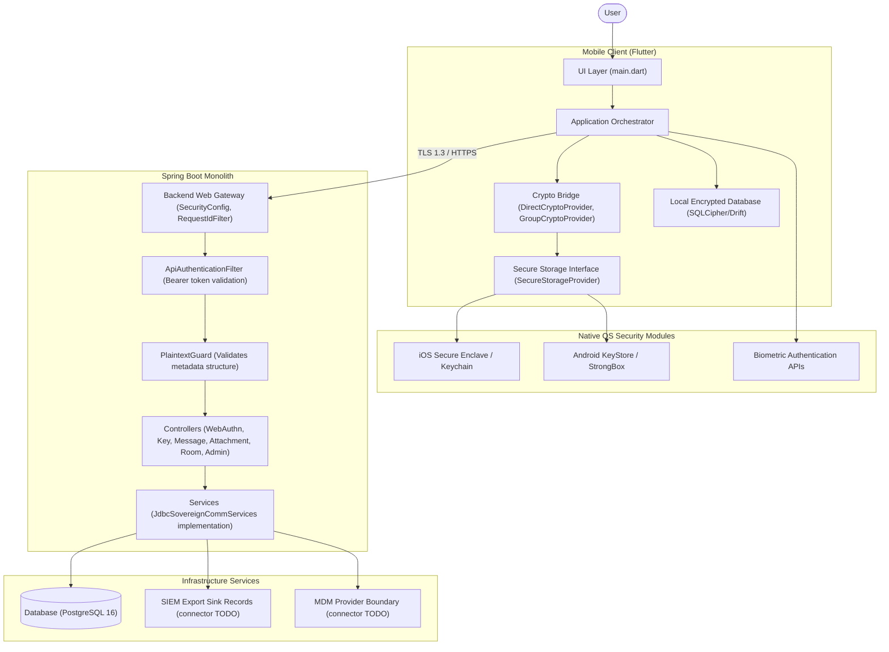

# Crypta

Crypta is a zero-trust, end-to-end encrypted communication platform scaffold designed for high-risk corporate, executive, and security-sensitive environments. It is an alpha-stage, security-focused scaffold, not production-ready secure messaging software and not independently audited.

The backend is intended to ingest, route, and persist ciphertext envelopes, public key material, policy records, encrypted attachment metadata, and audit events while keeping plaintext and private keys on client devices. Some code and package names still use `Sovereign Comm`.

## Local Backend Run

Copy `.env.example` to `.env`, set non-default secret values, then start the backend and database with:

```bash
docker compose up --build
```

For a direct Maven run against the Compose database, export `DATABASE_URL`, `DATABASE_USERNAME`, `DATABASE_PASSWORD`, `BOOTSTRAP_TOKEN`, `WEBAUTHN_RP_ID`, `WEBAUTHN_RP_NAME`, and `WEBAUTHN_ALLOWED_ORIGINS` before running:

```bash
mvn spring-boot:run
```

Provision organizations, users, and devices with `X-Bootstrap-Token`, then exchange a bootstrapped `userId` and `deviceId` at `POST /api/v1/bootstrap/sessions` for a bearer token. WebAuthn challenge creation is available, but credential finish endpoints fail closed until real passkey verification is configured.

## Documentation

- [Architecture](ARCHITECTURE.md)
- [Threat Model](THREAT_MODEL.md)
- [API Overview](API.md)
- [Deployment](DEPLOYMENT.md)
- [Security Policy](SECURITY.md)
- [Roadmap](ROADMAP.md)
- [Contributing](CONTRIBUTING.md)
- [Changelog](CHANGELOG.md)

Verified reference anchors checked on 2026-05-24:
* [IETF RFC 9420: Messaging Layer Security](https://www.ietf.org/rfc/rfc9420)
* [Signal PQXDH specification](https://signal.org/docs/specifications/pqxdh/)
* [W3C WebAuthn Level 3](https://www.w3.org/TR/webauthn-3/)
* [Spring Security passkeys/WebAuthn](https://docs.spring.io/spring-security/reference/servlet/authentication/passkeys.html)
* [Apple Secure Enclave key protection](https://developer.apple.com/documentation/Security/protecting-keys-with-the-secure-enclave)
* [Android hardware-backed Keystore](https://source.android.google.cn/docs/security/features/keystore?hl=en)
* [Sigstore Rekor transparency log overview](https://docs.sigstore.dev/logging/overview/)

---

## Structure Map



⸻

## What Is Implemented

### User Authentication & Sessions

The project includes WebAuthn/passkey challenge scaffolding, bootstrap session issuance, and random bearer tokens stored as SHA-256 hashes. WebAuthn credential finish verification is not yet configured.

Implemented with:

* [Spring Security](https://spring.io/projects/spring-security)
* [WebAuthn](https://www.w3.org/TR/webauthn-3/)
* [WebAuthnController](src/main/java/com/sovereigncomm/api/WebAuthnController.java)
* [ApiAuthenticationFilter](src/main/java/com/sovereigncomm/security/ApiAuthenticationFilter.java)
* [webauthn_credentials](src/main/resources/db/migration/V1__initial_secure_comm_schema.sql)
* [webauthn_challenges](src/main/resources/db/migration/V2__production_security_runtime.sql)
* [api_sessions](src/main/resources/db/migration/V2__production_security_runtime.sql)

### Zero-Trust Message Ingestion

The project implements API endpoints that ingest and store only encrypted ciphertext envelopes, verifying metadata constraints without exposing message payloads.

Implemented with:

* [Spring Boot](https://spring.io/projects/spring-boot)
* [MessageController](src/main/java/com/sovereigncomm/api/MessageController.java)
* [JdbcSovereignCommServices](src/main/java/com/sovereigncomm/service/JdbcSovereignCommServices.java)
* [encrypted_messages](src/main/resources/db/migration/V1__initial_secure_comm_schema.sql)

### Plaintext Prevention Guard

The project uses strict validation logic to reject JSON metadata payloads containing any keys matching patterns for plaintext, body content, or decrypted parameters.

Implemented with:

* [PlaintextGuard](src/main/java/com/sovereigncomm/security/PlaintextGuard.java)

### Cryptographic Key Management

The project provides prekey and identity key storage endpoints supporting Signal-style cryptographic handshake setups.

Implemented with:

* [PQXDH](https://signal.org/docs/specifications/pqxdh/)
* [Double Ratchet](https://signal.org/docs/specifications/doubleratchet/)
* [KeyController](src/main/java/com/sovereigncomm/api/KeyController.java)
* [identity_public_keys](src/main/resources/db/migration/V1__initial_secure_comm_schema.sql)
* [signed_prekeys](src/main/resources/db/migration/V1__initial_secure_comm_schema.sql)
* [one_time_prekeys](src/main/resources/db/migration/V1__initial_secure_comm_schema.sql)
* [pq_prekeys](src/main/resources/db/migration/V1__initial_secure_comm_schema.sql)

### Merkle Log Key Transparency

The project logs key history events in an append-only transparency log to verify public key integrity.

Implemented with:

* [KeyTransparencyService](src/main/java/com/sovereigncomm/service/JdbcSovereignCommServices.java)
* [key_transparency_entries](src/main/resources/db/migration/V1__initial_secure_comm_schema.sql)

### Tamper-Evident Auditing

The project implements audit events hash-chained per organization to verify log integrity and order.

Implemented with:

* [SHA-256](https://en.wikipedia.org/wiki/SHA-2)
* [AuditService](src/main/java/com/sovereigncomm/service/JdbcSovereignCommServices.java)
* [audit_events](src/main/resources/db/migration/V1__initial_secure_comm_schema.sql)

### Secure File Attachments

The project handles upload and download paths for client-side encrypted attachments.

Implemented with:

* [AttachmentController](src/main/java/com/sovereigncomm/api/AttachmentController.java)
* [encrypted_attachments](src/main/resources/db/migration/V1__initial_secure_comm_schema.sql)

### Emergency Lockdown Control

The project supports organizational and room-level emergency lockdowns that instantly suspend activity.

Implemented with:

* [AdminController](src/main/java/com/sovereigncomm/api/AdminController.java)
* [emergency_lockdowns](src/main/resources/db/migration/V1__initial_secure_comm_schema.sql)

### Device Trust & Attestation

The project tracks hardware-backed device attestation status, compliance state, and revocation actions.

Implemented with:

* [DeviceController](src/main/java/com/sovereigncomm/api/DeviceController.java)
* [devices](src/main/resources/db/migration/V1__initial_secure_comm_schema.sql)
* [device_attestations](src/main/resources/db/migration/V1__initial_secure_comm_schema.sql)

### Mobile Presentation & Contracts

The mobile module defines abstract cryptographic interfaces and visual presentation mockups for secure conversations.

Implemented with:

* [Flutter](https://flutter.dev)
* [Dart](https://dart.dev)
* [SovereignCommApp](mobile/lib/main.dart)
* [crypto_provider_contracts.dart](mobile/lib/src/domain/crypto_provider_contracts.dart)
* [native_security_module.dart](mobile/lib/src/native/native_security_module.dart)

### Containerized Deployment

The project contains local Docker Compose support and Kubernetes base manifests for deployment experimentation. These files require environment-specific hardening before production use.

Implemented with:

* [Docker](https://www.docker.com)
* [Kubernetes](https://kubernetes.io)
* [Dockerfile](Dockerfile)
* [docker-compose.yml](docker-compose.yml)
* [k8s/base/](k8s/base/)

### Compliance Query Language (CQL) & Smalltalk Rules Engine

The platform integrates a dynamic governance plane for real-time compliance auditing and rule-based policy enforcement:

* **Compliance Query Language (CQL)**: An ANTLR4-parsed, SQL-inspired language designed specifically for secure querying of `AUDIT_EVENTS`, `DEVICES`, and `ROOMS`.
  * Grammar: [CQL.g4](src/main/antlr4/com/sovereigncomm/cql/CQL.g4)
  * Compiler / Service: [CqlPolicyService](src/main/java/com/sovereigncomm/cql/CqlPolicyService.java)
  * Example Query: `SELECT id, event_type FROM AUDIT_EVENTS WHERE event_type = 'AUDIT_EXPORT_REQUESTED'`
* **Smalltalk Policy Engine**: A highly flexible, lightweight Smalltalk message-passing engine embedded within the Java policy layer to evaluate compliance rules with block evaluations (`[ :param | ... ]`).
  * Engine: [SmalltalkEngine](src/main/java/com/sovereigncomm/smalltalk/SmalltalkEngine.java)
  * Service: [SmalltalkService](src/main/java/com/sovereigncomm/smalltalk/SmalltalkService.java)
  * Example Script: `[ :device | device platform = 'iOS' ]`
* **Governance REST Endpoints**:
  * `POST /api/v1/governance/cql/parse` - Parse CQL query string to abstract AST representation.
  * `POST /api/v1/governance/cql/execute` - Execute secure CQL query against database audit tables.
  * `POST /api/v1/governance/smalltalk/evaluate` - Evaluate Smalltalk block against target object contexts dynamically.
